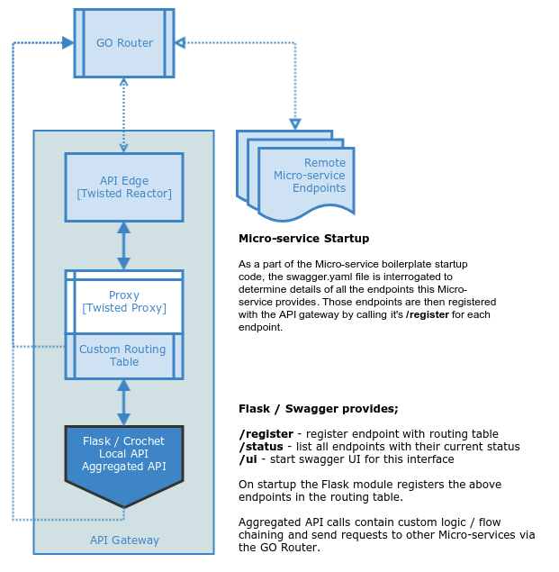

# API Gateway Microservice
[](https://travis-ci.org/ONSdigital/ras-api-gateway)
[](https://codecov.io/gh/onsdigital/ras-api-gateway)

## Overview

This Micro-service is under development and although it's working, will be subject
to frequent changes. Currently we're providing three discrete services;

* Proxying of incoming requests against connected Micro-sercices
* Native service registration functions such as /register
* An aggregated call interface for calling multiple endpoints and returning an aggregated response

The current CF deployment is available here; [Development API Gateway](https://api-demo.apps.mvp.onsclofo.uk/api/1.0.0/mygateway)
This version is skinned and supports dynamic updates.



### Configuration

* templates/mygateway.html - provides the default skin, all generic assets/resources
are currently loaded from a public CDN and the source for the skin can be found [here](https://github.com/puikinsh/gentelella).
* config.ini - is the generic micro-service configuration
* local.ini - is instance specific configuration
* swagger.yaml - is the configuration / specification for the local REST interface

### The Code

The meat of the code is in the ras_api_gateway folder, moving forward the business logic is
on aggregation.py. There is more refactoring that can be done here but we currently have a
documented / working pattern with error checking.

### Running Locally

To run locally from the root of your repository using sqlite (against the 'travis' profile), run:

```bash
 $ pip install pipenv
 $ pipenv install --dev
 $ ONS_ENV=travis pipenv run ./scripts/run.sh
```
